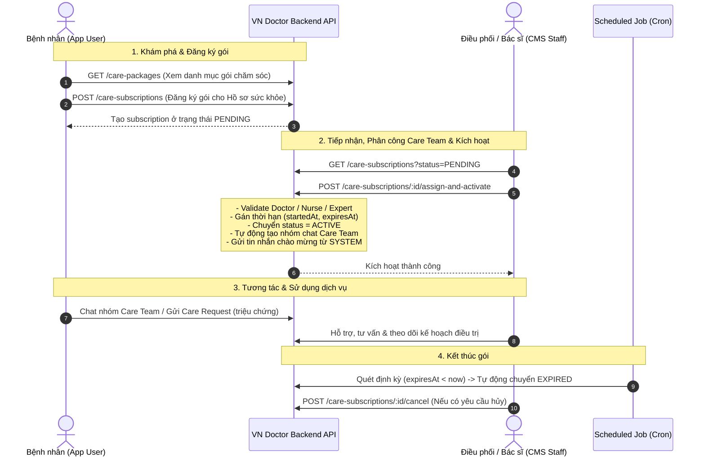

# 🩺 Luồng Mua & Quản Lý Gói Dịch Vụ Chăm Sóc Sức Khỏe (Care Package Subscription Flow)

> Tài liệu mô tả chi tiết toàn bộ quy trình nghiệp vụ từ lúc Bệnh nhân khám phá gói dịch vụ, đăng ký mua, Cơ sở y tế phân công Care Team kích hoạt gói, cho đến khi sử dụng và kết thúc gói.

---

## 📑 Mục Lục
1. [Sơ Đồ Luồng Nghiệp Vụ (Sequence Diagram)](#1-sơ-đồ-luồng-nghiệp-vụ-sequence-diagram)
2. [Các Thực Thể & Khái Niệm Cốt Lõi (Core Entities)](#2-các-thực-thể--khái-niệm-cốt-lõi-core-entities)
3. [Chi Tiết Từng Bước Trong Luồng](#3-chi-tiết-từng-bước-trong-luồng)
   - [Bước 1: Khám phá gói chăm sóc](#bước-1-khám-phá-gói-chăm-sóc)
   - [Bước 2: Bệnh nhân đăng ký mua gói (PENDING)](#bước-2-bệnh-nhân-đăng-ký-mua-gói-pending)
   - [Bước 3: Phân công Care Team & Kích hoạt gói (ACTIVE)](#bước-3-phân-công-care-team--kích-hoạt-gói-active)
   - [Bước 4: Sử dụng gói dịch vụ & Điều chỉnh Care Team](#bước-4-sử-dụng-gói-dịch-vụ--điều-chỉnh-care-team)
   - [Bước 5: Kết thúc chu kỳ & Hủy gói](#bước-5-kết-thúc-chu-kỳ--hủy-gói)
4. [Vòng Đời Trạng Thái (Status Lifecycle)](#4-vòng-đời-trạng-thái-status-lifecycle)
5. [Quy Tắc Nghiệp Vụ & Ràng Buộc (Business Rules)](#5-quy-tắc-nghiệp-vụ--ràng-buộc-business-rules)
6. [Danh Sách API Endpoints Liên Quan](#6-danh-sách-api-endpoints-liên-quan)

---

## 1. 📊 Sơ Đồ Luồng Nghiệp Vụ (Sequence Diagram)



---

## 2. 🧩 Các Thực Thể & Khái Niệm Cốt Lõi (Core Entities)

| Thực thể / Khái niệm | Mô tả | Mã nguồn |
| :--- | :--- | :--- |
| **`CarePackage`** | Gói dịch vụ chăm sóc do Cơ sở y tế (`Facility`) cung cấp (giá tiền, thời hạn ngày, phân loại `STANDARD`/`VIP`, bác sĩ chuyên gia...). | [`src/modules/care-packages/entities/care-package.entity.ts`](file:///c:/Users/Admin/Desktop/tmt-navi/vndoctor/src/modules/care-packages/entities/care-package.entity.ts) |
| **`PatientCareSubscription`** | Lượt đăng ký gói của một Hồ sơ sức khỏe (`HealthProfile`). Quản lý trạng thái, ngày kích hoạt/hết hạn, và đội ngũ y tế được phân công. | [`src/modules/care-subscriptions/entities/care-subscription.entity.ts`](file:///c:/Users/Admin/Desktop/tmt-navi/vndoctor/src/modules/care-subscriptions/entities/care-subscription.entity.ts) |
| **`Care Team`** | Đội ngũ y tế phụ trách theo dõi bệnh nhân: Bác sĩ chính (`assignedDoctorId`), Điều dưỡng hỗ trợ (`assignedNurseId`), và Bác sĩ chuyên gia (`assignedExpertId` cho gói VIP). | [`src/modules/staff/entities/staff-user.entity.ts`](file:///c:/Users/Admin/Desktop/tmt-navi/vndoctor/src/modules/staff/entities/staff-user.entity.ts) |
| **`Conversation (CARE_TEAM)`** | Phòng chat nhóm tự động khởi tạo khi kích hoạt gói để bệnh nhân và Care Team trao đổi trực tiếp. | [`src/modules/care-subscriptions/entities/conversation.entity.ts`](file:///c:/Users/Admin/Desktop/tmt-navi/vndoctor/src/modules/care-subscriptions/entities/conversation.entity.ts) |
| **`PatientCareRequest`** | Yêu cầu hỗ trợ y tế / báo cáo triệu chứng phát sinh trong quá trình bệnh nhân sử dụng gói. | [`src/modules/care-requests/entities/care-request.entity.ts`](file:///c:/Users/Admin/Desktop/tmt-navi/vndoctor/src/modules/care-requests/entities/care-request.entity.ts) |

---

## 3. 🔍 Chi Tiết Từng Bước Trong Luồng

### Bước 1: Khám phá gói chăm sóc
- **Endpoint**: `GET /care-packages`
- **Quyền hạn**: Public hoặc App User
- **Nghiệp vụ**:
  - Bệnh nhân duyệt danh sách các gói chăm sóc theo cơ sở y tế.
  - Lọc theo loại gói (`STANDARD` hoặc `VIP`), trạng thái `ACTIVE`.
  - Xem thông tin chi tiết: Tên, mã gói (`code`), thời hạn (`durationDays`), mức giá (`priceAmount`), mô tả quyền lợi.

---

### Bước 2: Bệnh nhân đăng ký mua gói (`PENDING`)
- **Endpoint**: `POST /care-subscriptions`
- **Quyền hạn**: App User (`AppAuthGuard`)
- **Body Request**:
  ```json
  {
    "healthProfileId": "7c9e6679-7425-40de-944b-e07fc1f90ae7",
    "carePackageId": "3b2e5641-8973-41bb-83cd-8e6d1e498c52"
  }
  ```
- **Xử lý phía Server**:
  1. **Kiểm tra quyền sở hữu hồ sơ**: Xác minh `healthProfile.accountId === currentAccount.id`.
  2. **Kiểm tra trạng thái gói**: Gói chăm sóc phải tồn tại và `status === CarePackageStatus.ACTIVE`.
  3. **Kiểm tra đăng ký trùng**: Đảm bảo hồ sơ chưa có đăng ký nào cùng gói này đang ở trạng thái `ACTIVE`.
  4. **Tạo bản ghi đăng ký**:
     - `status`: **`PENDING`**
     - `startedAt`: `null`
     - `expiresAt`: `null`
     - `assignedExpertId`: Tự động kế thừa từ `carePackage.doctorExpertId` nếu có.

---

### Bước 3: Phân công Care Team & Kích hoạt gói (`ACTIVE`)
- **Endpoint**: `POST /care-subscriptions/:id/assign-and-activate`
- **Quyền hạn**: CMS Staff (`StaffAuthGuard`, Role `ADMIN` hoặc `DOCTOR`)
- **Body Request**:
  ```json
  {
    "assignedDoctorId": "1a2b3c4d-5e6f-7a8b-9c0d-1e2f3a4b5c6d",
    "assignedNurseId": "2b3c4d5e-6f7a-8b9c-0d1e-2f3a4b5c6d7e",
    "assignedExpertId": "3c4d5e6f-7a8b-9c0d-1e2f-3a4b5c6d7e8f" // Bắt buộc nếu gói VIP
  }
  ```
- **Xử lý Transaction nguyên tử**:
  1. **Xác thực nhân viên y tế**:
     - Bác sĩ chính phải có role `DOCTOR` hoặc `ADMIN`, thuộc cùng `facilityId` và đang hoạt động (`isActive = true`).
     - Điều dưỡng phải có role `NURSE` hoặc `STAFF`, thuộc cùng `facilityId` và đang hoạt động.
     - Với gói `VIP`: Bắt buộc phải có Bác sĩ chuyên gia (`assignedExpertId`).
  2. **Tính toán thời hạn**:
     - `startedAt = now`
     - `expiresAt = now + (carePackage.durationDays * 24 * 60 * 60 * 1000)`
  3. **Cập nhật trạng thái**: Chuyển subscription sang **`ACTIVE`**.
  4. **Khởi tạo phòng chat Care Team**:
     - Tạo bản ghi `Conversation` với `type = ConversationType.CARE_TEAM`, gắn với `subscriptionId` và `healthProfileId`.
  5. **Gửi tin nhắn chào mừng từ hệ thống**:
     - Tự động tạo tin nhắn `SenderType.SYSTEM` giới thiệu đội ngũ y tế phụ trách và hướng dẫn bệnh nhân.

---

### Bước 4: Sử dụng gói dịch vụ & Điều chỉnh Care Team
- **Tương tác trong thời gian hiệu lực**:
  - Bệnh nhân và nhân viên y tế trao đổi qua phòng chat nhóm `CARE_TEAM`.
  - Bệnh nhân gửi yêu cầu y tế hoặc báo cáo bất thường (`POST /care-requests`).
- **Thay đổi nhân sự phụ trách (nếu cần)**:
  - **Endpoint**: `PATCH /care-subscriptions/:id/care-team`
  - **Quyền hạn**: CMS Admin
  - Hỗ trợ đổi Bác sĩ chính, Điều dưỡng hoặc Chuyên gia khi có sự thay đổi ca trực/nghỉ phép.

---

### Bước 5: Kết thúc chu kỳ & Hủy gói
1. **Tự động hết hạn (`EXPIRED`)**:
   - Scheduled Job nền [`expireSubscriptionsJob()`](file:///c:/Users/Admin/Desktop/tmt-navi/vndoctor/src/modules/care-subscriptions/care-subscriptions.service.ts#L499-L519) định kỳ quét các subscription có `status = ACTIVE` và `expiresAt < now` để chuyển sang `EXPIRED`.
2. **Hủy gói chủ động (`CANCELLED`)**:
   - **Endpoint**: `POST /care-subscriptions/:id/cancel`
   - **Quyền hạn**: CMS Admin thực hiện khi bệnh nhân yêu cầu dừng gói.

---

## 4. 🔄 Vòng Đời Trạng Thái (Status Lifecycle)

```plaintext
      [ Bệnh nhân đăng ký qua App ]
                    │
                    ▼
               ┌─────────┐
               │ PENDING │
               └────┬────┘
                    │ (CMS Phân công Care Team & Kích hoạt)
                    ▼
               ┌─────────┐
       ┌───────┤ ACTIVE  ├───────┐
       │       └────┬────┘       │
(Admin Hủy gói)     │ (Quá hạn)  │ (Admin Hủy gói)
       │            ▼            │
       │      ┌───────────┐      │
       │      │  EXPIRED  │      │
       │      └───────────┘      │
       ▼                         ▼
  ┌───────────┐             ┌───────────┐
  │ CANCELLED │             │ CANCELLED │
  └───────────┘             └───────────┘
```

| Trạng thái | Ý nghĩa | Hành động tiếp theo có thể |
| :--- | :--- | :--- |
| **`PENDING`** | Chờ tiếp nhận và phân công bác sĩ. Chưa tính hạn dùng. | `assign-and-activate`, `cancel`, `delete` |
| **`ACTIVE`** | Đang có hiệu lực. Đã mở phòng chat nhóm Care Team. | `updateCareTeam`, `cancel`, Tự động `EXPIRED` qua Cron |
| **`EXPIRED`** | Đã hết thời hạn sử dụng gói. | Xem lịch sử |
| **`CANCELLED`** | Đã bị hủy trước hoặc sau khi hết hạn. | Xem lịch sử |

---

## 5. 🛡️ Quy Tắc Nghiệp Vụ & Ràng Buộc (Business Rules)

1. **Bảo mật & Quyền sở hữu (Multi-tenancy & Ownership)**:
   - Bệnh nhân chỉ được đăng ký gói cho `HealthProfile` thuộc tài khoản của mình.
   - Nhân viên y tế chỉ được xem, phân công và kích hoạt các gói thuộc Cơ sở y tế (`Facility`) mà mình đang công tác.
2. **Quy tắc gói VIP**:
   - Gói loại `VIP` bắt buộc phải có Bác sĩ chuyên gia (`assignedExpertId`). Nếu chưa có từ lúc tạo gói thì khi kích hoạt phải truyền lên `assignedExpertId`.
3. **Tính toàn vẹn dữ liệu (Transaction Atomicity)**:
   - Quá trình kích hoạt gói, tính toán thời hạn, cập nhật trạng thái, khởi tạo phòng chat và gửi tin nhắn chào mừng được thực thi trong một Database Transaction duy nhất.
4. **Không kích hoạt trùng**:
   - Một hồ sơ bệnh nhân không thể cùng lúc đăng ký 2 gói chăm sóc giống nhau đang ở trạng thái `ACTIVE`.

---

## 6. 📡 Danh Sách API Endpoints Liên Quan

| Method | Endpoint | Quyền hạn | Mô tả |
| :--- | :--- | :--- | :--- |
| `GET` | `/care-packages` | Public / App | Lấy danh sách gói dịch vụ chăm sóc sức khỏe |
| `POST` | `/care-subscriptions` | App Auth | Bệnh nhân đăng ký mua gói (tạo trạng thái `PENDING`) |
| `GET` | `/care-subscriptions/me` | App Auth | Bệnh nhân xem các gói đã đăng ký của mình |
| `GET` | `/care-subscriptions` | Staff Auth | CMS xem danh sách đăng ký theo Cơ sở y tế |
| `GET` | `/care-subscriptions/:id` | Staff Auth | Xem chi tiết lượt đăng ký và Care Team |
| `POST` | `/care-subscriptions/:id/assign-and-activate` | CMS Admin/Doctor | Phân công Care Team & Kích hoạt gói (`ACTIVE`) |
| `PATCH` | `/care-subscriptions/:id/care-team` | CMS Admin | Thay đổi nhân sự Care Team |
| `POST` | `/care-subscriptions/:id/cancel` | CMS Admin | Hủy gói đăng ký |
| `DELETE` | `/care-subscriptions/:id` | CMS Admin | Xóa mềm lượt đăng ký |
| `POST` | `/care-requests` | App Auth | Bệnh nhân gửi yêu cầu hỗ trợ trong thời gian gói `ACTIVE` |
