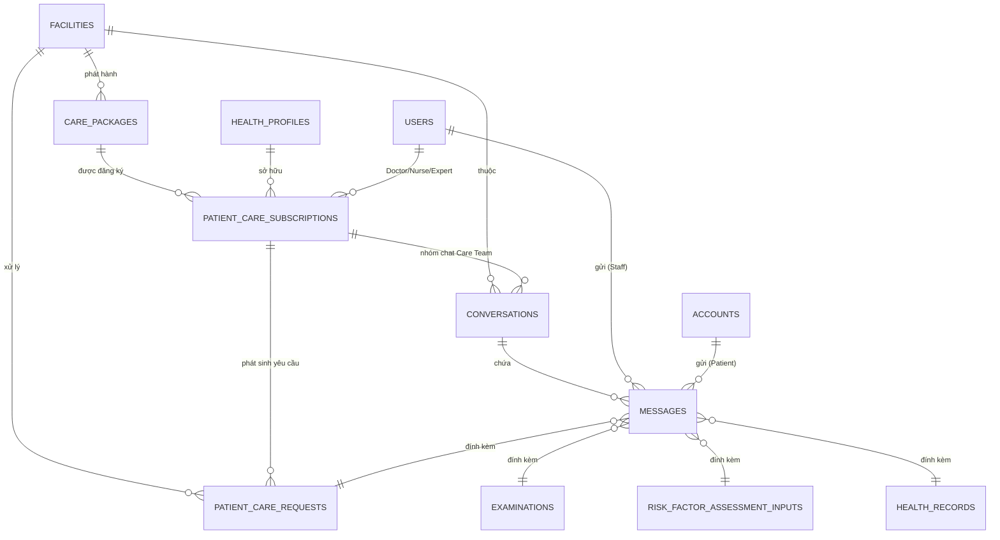

# 📋 KẾ HOẠCH PHÁT TRIỂN HỆ THỐNG - PHASE 2 (SPRINT PLAN)

> **Dự án**: VN Doctor Backend (NestJS Base Template)  
> **Cơ sở dữ liệu nguồn**: `vndoctor (1).sql`  
> **Mục tiêu Phase 2**: Xây dựng hệ thống **Chăm sóc sức khỏe liên tục (Continuous Care)**, bao gồm: Quản lý gói dịch vụ y tế, Phân công đội ngũ chăm sóc (Care Team), Tiếp nhận yêu cầu hỗ trợ (Care Requests), và Kênh hội thoại/Chat y tế thời gian thực tích hợp thẻ hồ sơ sức khỏe.

---

## 🏗️ 1. TỔNG QUAN CƠ SỞ DỮ LIỆU & QUAN HỆ THỰC THỂ MỚI



---

## 🗓️ 2. CHI TIẾT KẾ HOẠCH PHÂN CHIA SPRINT

```plaintext
Phase 2 Timeline:
├── Sprint 1: Nền tảng Gói Dịch Vụ Chăm Sóc Sức Khỏe (Care Packages)
├── Sprint 2: Đăng ký Gói Chăm Sóc & Phân Công Care Team (Care Subscriptions)
├── Sprint 3: Quản lý Yêu Cầu Chăm Sóc Y Tế (Patient Care Requests)
└── Sprint 4: Hội Thoại Y Tế & Realtime WebSocket Gateway (Chat & Messages)
```

---

### 🚀 SPRINT 1: NỀN TẢNG GÓI DỊCH VỤ CHĂM SÓC SỨC KHỎE (CARE PACKAGES)
> **Thời gian dự kiến**: 1 tuần  
> **Mục tiêu**: Xây dựng cấu trúc danh mục gói chăm sóc sức khỏe của cơ sở y tế (định nghĩa gói, phân loại Tiêu chuẩn/VIP, thời hạn, bảng giá).

#### 1. Module `care-packages`
*Quản lý danh mục gói dịch vụ chăm sóc sức khỏe của cơ sở y tế.*

- **Thực thể**: `CarePackageEntity` (Bảng `care_packages`)
  - `id`: UUID (PK, kế thừa `BaseEntity`)
  - `facility_id`: UUID (FK -> `facilities.id`)
  - `code`: String (Mã gói, Unique: ví dụ `PKG-CARDIO-30D`)
  - `name`: String (Tên gói)
  - `type`: Enum `STANDARD` | `VIP`
  - `description`: Text (Mô tả quyền lợi)
  - `duration_days`: Integer (Thời hạn gói: 30, 90, 180, 365 ngày)
  - `price_amount`: Decimal(14,2) (Giá niêm yết)
  - `status`: Enum `ACTIVE` | `INACTIVE`
- **Danh sách API Endpoints**:
  - `POST /api/v1/care-packages`: Tạo gói chăm sóc (Role: `ADMIN`).
  - `GET /api/v1/care-packages`: Lấy danh sách gói (Hỗ trợ phân trang, lọc theo `facility_id`, `type`, `status`).
  - `GET /api/v1/care-packages/:id`: Xem chi tiết gói.
  - `PATCH /api/v1/care-packages/:id`: Chỉnh sửa thông tin gói.
  - `PATCH /api/v1/care-packages/:id/status`: Đổi trạng thái kích hoạt `ACTIVE`/`INACTIVE`.

#### 2. Nhiệm vụ kiểm thử & Migration
- [ ] Viết migration cho `care_packages`.
- [ ] Unit test cho `CarePackageService` và `CarePackageController` (Coverage >= 80%).
- [ ] Viết tài liệu Swagger `@Doc()` cho toàn bộ Controller.

---

### 🚀 SPRINT 2: ĐĂNG KÝ GÓI & PHÂN CÔNG CARE TEAM (CARE SUBSCRIPTIONS)
> **Thời gian dự kiến**: 1 - 2 tuần  
> **Mục tiêu**: Xử lý luồng Bệnh nhân đăng ký gói (`PENDING`), Điều phối viên/Bác sĩ trên Web CMS phân công Care Team, Backend tự động kích hoạt gói và khởi tạo phòng chat nhóm y tế.

#### 1. Quy trình Vận hành Chuẩn (Web CMS Assignment Flow)
1. **Bệnh nhân đăng ký (App Mobile)**:
   - Bệnh nhân chọn gói chăm sóc và hồ sơ người khám -> Gọi API đăng ký -> Tạo `patient_care_subscriptions` ở trạng thái **`PENDING`** (chưa có ngày bắt đầu/kết thúc và chưa có Care Team).
2. **Điều phối viên / Viện phân công (Web CMS)**:
   - Điều phối viên xem danh sách các subscription ở trạng thái `PENDING`.
   - Chọn nhân sự từ danh sách nhân viên y tế của viện:
     - **Bác sĩ phụ trách chính** (`assignedDoctorId`): Lọc nhân viên có `role = 'DOCTOR'` & `is_active = true`.
     - **Điều dưỡng hỗ trợ** (`assignedNurseId`): Lọc nhân viên có `role = 'NURSE'` & `is_active = true`.
     - **Bác sĩ chuyên gia** (`assignedExpertId`): Bắt buộc nếu là gói `VIP`.
   - Nhấn **"Phân công & Kích hoạt gói"**.
3. **Backend Xử lý Tự động (Atomic Transaction)**:
   - Validate thông tin nhân sự (Đúng `facility_id`, đúng `role`, đang `is_active`).
   - Tự động tính: `started_at = NOW()` và `expires_at = NOW() + care_package.duration_days`.
   - Chuyển `status -> ACTIVE`.
   - Tự động tạo 1 bản ghi `conversations` dạng **`CARE_TEAM`** gắn với `subscription_id`.
   - Tự động gửi tin nhắn **`SYSTEM`** chào mừng vào phòng chat, liệt kê danh sách bác sĩ/điều dưỡng phụ trách.

#### 2. Module `care-subscriptions`
- **Thực thể**: `PatientCareSubscriptionEntity` (Bảng `patient_care_subscriptions`)
  - `id`: UUID (PK, kế thừa `BaseEntity`)
  - `health_profile_id`: UUID (FK -> `health_profiles.id`)
  - `care_package_id`: UUID (FK -> `care_packages.id`)
  - `assigned_doctor_id`: UUID (FK -> `users.id`, Bác sĩ chính)
  - `assigned_nurse_id`: UUID (FK -> `users.id`, Y tá/Điều dưỡng)
  - `assigned_expert_id`: UUID (FK -> `users.id`, Chuyên gia cố vấn)
  - `status`: Enum `PENDING` | `ACTIVE` | `EXPIRED` | `CANCELLED`
  - `started_at`: Timestamp (Ngày kích hoạt)
  - `expires_at`: Timestamp (Ngày hết hạn = `started_at + duration_days`)
- **Danh sách API Endpoints**:
  - `POST /api/v1/care-subscriptions`: Đăng ký gói chăm sóc cho hồ sơ bệnh nhân (Role: `PATIENT`, `ADMIN` -> Tạo trạng thái `PENDING`).
  - `GET /api/v1/care-subscriptions`: Lấy danh sách đăng ký gói (Hỗ trợ phân trang, lọc theo `facility_id`, `status=PENDING/ACTIVE`, `healthProfileId`, `doctorId`).
  - `GET /api/v1/care-subscriptions/:id`: Xem chi tiết đăng ký gói kèm thông tin chi tiết Care Team.
  - `POST /api/v1/care-subscriptions/:id/assign-and-activate`: **Phân công Bác sĩ, Y tá và tự động kích hoạt gói + tạo phòng chat** (Role: `ADMIN`, `DOCTOR`).
  - `PATCH /api/v1/care-subscriptions/:id/care-team`: Thay đổi Bác sĩ/Y tá phụ trách khi có chuyển ca/nghỉ phép (Role: `ADMIN`).
  - `POST /api/v1/care-subscriptions/:id/cancel`: Hủy gói đăng ký (Role: `ADMIN`).

#### 3. Tự động hóa & Background Job (BullMQ / Scheduler)
- **Subscription Expiration Job**:
  - Thiết lập Cronjob chạy hàng ngày (ví dụ `0 0 * * *`) quét các subscription có `expires_at < NOW()` và `status = ACTIVE` để tự động chuyển sang `EXPIRED`.
  - Tự động cập nhật trạng thái phòng chat liên quan sang `CLOSED` khi gói hết hạn.

#### 4. Nhiệm vụ kiểm thử & Migration
- [ ] Viết migration cho `patient_care_subscriptions`.
- [ ] Unit test cho `CareSubscriptionService`:
  - Test luồng đăng ký tạo trạng thái `PENDING`.
  - Test phân công và kích hoạt gói: kiểm tra validation role `DOCTOR`, `NURSE`, kiểm tra điều kiện bắt buộc `assignedExpertId` đối với gói `VIP`.
  - Test tính toán ngày bắt đầu `started_at` và ngày kết thúc `expires_at`.
  - Test khởi tạo `conversations` và tin nhắn mở đầu `SYSTEM`.
- [ ] E2E test cho toàn bộ luồng từ Đăng ký -> Phân công & Kích hoạt -> Kiểm tra phòng chat được sinh ra.

---

### 🚀 SPRINT 3: QUẢN LÝ YÊU CẦU CHĂM SÓC Y TẾ (PATIENT CARE REQUESTS)
> **Thời gian dự kiến**: 1 - 2 tuần  
> **Mục tiêu**: Kênh phản hồi nhanh tiếp nhận triệu chứng bất thường, hình ảnh tổn thương/đơn thuốc từ bệnh nhân và quy trình xử lý của Care Team.

#### 1. Module `care-requests`
*Quản lý phiếu yêu cầu chăm sóc y tế (Care Requests).*

- **Thực thể**: `PatientCareRequestEntity` (Bảng `patient_care_requests`)
  - `id`: UUID (PK, kế thừa `BaseEntity`)
  - `request_code`: String (Mã yêu cầu Unique: ví dụ `REQ-2026-001`)
  - `facility_id`: UUID (FK -> `facilities.id`)
  - `subscription_id`: UUID (FK -> `patient_care_subscriptions.id`)
  - `assigned_user_id`: UUID (FK -> `users.id`, Nhân viên y tế trực tiếp nhận)
  - `status`: Enum `PENDING` | `IN_PROGRESS` | `RESOLVED` | `CANCELLED`
  - `title`: String (Tiêu đề yêu cầu: Cảm thấy tức ngực sau uống thuốc, hỏi về đơn thuốc...)
  - `media_urls`: Array of Strings (Danh sách link ảnh đính kèm)
  - `resolution_note`: Text (Nội dung phản hồi / Kết luận xử lý của Bác sĩ)
  - `resolved_at`: Timestamp (Thời điểm xử lý xong)
- **Danh sách API Endpoints**:
  - `POST /api/v1/care-requests`: Bệnh nhân tạo yêu cầu chăm sóc mới (kèm ảnh `media_urls`, tiêu đề, mô tả).
  - `GET /api/v1/care-requests`: Danh sách yêu cầu (Phân trang, lọc theo trạng thái, cơ sở, nhân viên phụ trách).
  - `GET /api/v1/care-requests/:id`: Xem chi tiết yêu cầu kèm thông tin bệnh nhân và gói đang sử dụng.
  - `PATCH /api/v1/care-requests/:id/assign`: Phân công nhân viên y tế xử lý (`assigned_user_id`).
  - `PATCH /api/v1/care-requests/:id/status`: Cập nhật trạng thái (`IN_PROGRESS`, `CANCELLED`).
  - `POST /api/v1/care-requests/:id/resolve`: Bác sĩ phản hồi kết luận xử lý (`resolution_note`) và chuyển `RESOLVED`.

#### 2. Business Rules & Tích hợp vào Phòng Chat
- **Ràng buộc gói**: Bệnh nhân chỉ được gửi yêu cầu khi có gói `subscription` ở trạng thái `ACTIVE` (áp dụng cho cả gói `STANDARD` và `VIP`).
- **Tự động sinh mã**: Tự sinh `request_code` theo định dạng `REQ-YYYY-XXXXX`.
- **Đồng bộ vào Chat Room**: Khi bệnh nhân tạo Care Request thành công, hệ thống tự động chèn một tin nhắn vào phòng chat của nhóm Care Team với `message_type = 'CARE_REQUEST'` và `resource_id = care_request.id` để Bác sĩ/Điều dưỡng trực tiếp nhìn thấy và phản hồi ngay trong đoạn chat.

---

### 🚀 SPRINT 4: HỘI THOẠI Y TẾ & REALTIME WEBSOCKET (CHAT & MESSAGING)
> **Thời gian dự kiến**: 2 tuần  
> **Mục tiêu**: Xây dựng nền tảng chat trực tuyến giữa Bệnh nhân và Care Team, tích hợp đính kèm thực thể y tế và Realtime Gateway.

#### 1. Module `conversations` & `messages` (REST APIs)
- **Thực thể**:
  - `ConversationEntity` (Bảng `conversations`):
    - `id`, `facility_id`, `type` (`CARE_TEAM` | `DIRECT`), `title`, `status` (`ACTIVE` | `CLOSED` | `ARCHIVED`)
    - `subscription_id` (Liên kết gói), `health_profile_id`, `direct_user_id`
    - `last_message_id`, `last_message_at`, `last_message_preview`
  - `MessageEntity` (Bảng `messages`):
    - `id`, `conversation_id`, `sender_type` (`STAFF` | `PATIENT` | `SYSTEM`)
    - `sender_user_id`, `sender_account_id`
    - `message_type` (`TEXT`, `IMAGE`, `FILE`, `EXAMINATION`, `RISK_ASSESSMENT`, `HEALTH_RECORD`, `CARE_REQUEST`, `SYSTEM`)
    - `content`, `resource_id` (UUID thực thể y tế tương ứng), `media_url`
    - `reply_to_message_id`, `is_pinned`, `is_deleted`
- **Danh sách API Endpoints**:
  - `GET /api/v1/conversations`: Lấy danh sách phòng chat của User/Patient (kèm tin nhắn mới nhất, số tin chưa đọc).
  - `POST /api/v1/conversations/direct`: Khởi tạo hội thoại 1-1 giữa Bác sĩ và Bệnh nhân.
  - `GET /api/v1/conversations/:id/messages`: Lấy danh sách tin nhắn phân trang (Cursor-based Pagination).
  - `POST /api/v1/conversations/:id/messages`: Gửi tin nhắn qua REST API (Hỗ trợ kèm `resource_id` phiếu khám, chỉ số đo...).
  - `PATCH /api/v1/messages/:id/pin`: Ghim / Bỏ ghim tin nhắn.
  - `DELETE /api/v1/messages/:id`: Thu hồi tin nhắn (`is_deleted = true`).

#### 2. Module `chat-gateway` (WebSocket Realtime)
- **Công nghệ**: `@nestjs/websockets`, `@nestjs/platform-socket.io`.
- **Cơ chế hoạt động**:
  - Kết nối xác thực: JWT Bearer Token qua Handshake Auth.
  - Room Management: Mỗi `conversation_id` là một socket room.
- **Danh sách Event WebSocket**:
  - `join_room` / `leave_room`: Tham gia / Rời phòng chat.
  - `send_message`: Client gửi tin nhắn realtime -> Server lưu DB -> Broadcast `new_message` tới room.
  - `typing`: Báo hiệu đang gõ tin nhắn.
  - `message_read`: Đánh dấu đã đọc tin nhắn.

#### 3. Nhiệm vụ kiểm thử & Tích hợp
- [ ] Kiểm thử hiệu năng truy vấn tin nhắn với Index `messages_index_46` (`conversation_id, created_at`).
- [ ] Viết kịch bản E2E test cho luồng gửi nhận tin nhắn Realtime & REST API.

---

## 📐 3. NGUYÊN TẮC THIẾT KẾ & CODING STANDARDS (NEST-BASE)

1. **Tuân thủ Clean Architecture**:
   - Controller chỉ làm nhiệm vụ Routing, Parse DTO và Document Swagger (`@Doc()`).
   - Mọi nghiệp vụ, tính toán, gọi Database và phát sự kiện nằm trong `Service`.
2. **Nghiêm cấm dùng `any`**:
   - Tất cả DTO, Entity, Response và tham số phải định kiểu rõ ràng (`interface`, `class`, `type`).
3. **Kế thừa `BaseEntity`**:
   - Tất cả Entity mới bắt buộc kế thừa `BaseEntity` (có sẵn `id`, `createdAt`, `updatedAt`, `deletedAt`).
4. **Xử lý Ngoại lệ chuẩn hóa**:
   - Sử dụng các Exception tùy biến từ `@/commons/exceptions` và định nghĩa mã lỗi trong `ErrorCode`.
5. **Đảm bảo tính toàn vẹn dữ liệu (Transactions)**:
   - Các nghiệp vụ liên quan nhiều bảng (ví dụ: Kích hoạt Subscription -> Tạo Conversation -> Gửi tin nhắn chào mừng) bắt buộc chạy trong TypeORM QueryRunner Transaction.

---

## 🏁 4. TỔNG KẾT & THỨ TỰ BẮT ĐẦU

| Thứ tự | Sprint | Tính năng trọng tâm | Độ ưu tiên |
| :---: | :--- | :--- | :---: |
| 1 | **Sprint 1** | Gói dịch vụ chăm sóc (`care_packages`) | 🔴 High |
| 2 | **Sprint 2** | Đăng ký gói (`patient_care_subscriptions`) & Phân công Care Team | 🔴 High |
| 3 | **Sprint 3** | Yêu cầu chăm sóc (`patient_care_requests`) | 🟡 Medium |
| 4 | **Sprint 4** | Chat & Realtime WebSocket (`conversations`, `messages`, `chat-gateway`) | 🟡 Medium |
